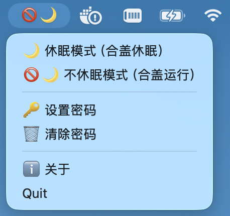

# 🌙 Mac 睡眠切换器 (Mac Sleep Switch)

[](https://opensource.org/licenses/MIT)
[](https://www.python.org/)
[](https://www.apple.com/macos/)

一个优雅的 macOS 菜单栏工具，一键切换合盖休眠模式。当你需要保持 WebSocket 连接、后台下载或远程访问时，可以临时禁用合盖休眠；不需要时又可以轻松恢复。



## ✨ 功能特性

- 🚫🌙 **一键切换**：菜单栏点击即可在"休眠"和"不休眠"模式间切换
- 🔒 **密码安全**：使用 macOS 钥匙串加密存储密码，无需硬编码或每次输入
- 🔐 **隐私保护**：密码输入框采用 macOS 原生遮罩，支持二次确认
- 📊 **状态可视化**：菜单栏图标直观显示当前模式（🌙 = 休眠，🚫🌙 = 不休眠）
- ⚡ **自动锁屏**：切换模式后自动锁屏，保护隐私
- 🔄 **状态记忆**：启动时自动检测并显示当前系统状态

## 🚀 快速开始

### 前置要求

- macOS 10.13 (High Sierra) 或更高版本
- Python 3.6 或更高版本
- 管理员权限（用于修改系统睡眠设置）

### 安装

#### 方法一：直接运行（适合开发测试）

1. 克隆仓库：
```bash
git clone https://github.com/hmisty/mac_sleep_switch.git
cd mac_sleep_switch
```

2. 安装依赖：
```bash
pip install -r requirements.txt
```

如果没有 `requirements.txt`，可以手动安装：
```bash
pip install rumps keyring
```

3. 运行应用：
```bash
python mac_sleep_switch.py
```

#### 方法二：打包成独立应用（推荐日常使用）

1. 安装打包工具：
```bash
pip install py2app
```

2. 执行打包：
```bash
python setup.py py2app
```

3. 打包完成后，在 `dist` 目录中找到 `Mac睡眠切换器.app`，将其拖入应用程序文件夹。

4. （可选）设置开机自启：
   - 打开 **系统设置 > 通用 > 登录项**
   - 点击 **+** 号，添加 `Mac睡眠切换器.app`

## 📖 使用指南

### 首次运行

1. 启动应用后，菜单栏会出现 🌙 图标
2. 首次运行会自动弹出密码设置窗口
3. 输入你的 Mac 登录密码（输入时显示黑点，安全）
4. 再次确认密码
5. 验证通过后，密码将安全存储在钥匙串中

### 日常使用

- **切换到不休眠模式**：点击菜单栏 🌙 → 选择 **"🚫🌙 不休眠模式（合盖运行）"**
- **切换回休眠模式**：点击菜单栏 🚫🌙 → 选择 **"🌙 休眠模式（合盖休眠）"**
- **修改密码**：点击菜单 → **"🔑 设置密码"**
- **清除密码**：点击菜单 → **"🗑️ 清除密码"**

### 图标含义

| 图标 | 模式 | 说明 |
|:----:|------|------|
| 🌙 | 休眠模式 | 合盖时电脑会正常休眠（默认状态） |
| 🚫🌙 | 不休眠模式 | 合盖时电脑保持运行，WebSocket 等长连接不会断开 |

## 🛠️ 技术实现

### 核心原理

- 使用 `pmset -a disablesleep 1/0` 命令控制合盖休眠行为
- 通过 `keyring` 库与 macOS 钥匙串交互，安全存储密码
- 利用 `rumps` 库创建菜单栏应用
- 使用 AppleScript 调用系统原生密码对话框，实现遮罩输入

### 项目结构

```
mac_sleep_switch/
├── mac_sleep_switch.py    # 主程序
├── setup.py                # py2app 打包配置
├── requirements.txt        # Python 依赖
├── README.md               # 本文档
└── screenshot.png          # 应用截图
```

## 🤝 贡献指南

欢迎提交 Pull Request 或 Issue！

1. Fork 本仓库
2. 创建你的特性分支 (`git checkout -b feature/AmazingFeature`)
3. 提交你的修改 (`git commit -m 'Add some AmazingFeature'`)
4. 推送到分支 (`git push origin feature/AmazingFeature`)
5. 打开一个 Pull Request

### 开发建议

- 代码风格遵循 [PEP 8](https://www.python.org/dev/peps/pep-0008/)
- 提交前确保现有功能不受影响
- 如果添加新功能，请同时更新文档

## 📝 待办事项

- [ ] 添加更详细的错误处理
- [ ] 支持多语言（中文/英文）
- [ ] 添加自动更新功能
- [ ] 支持更多的电源管理选项
- [ ] 创建 Homebrew 安装方式

## 📄 许可证

本项目采用 MIT 许可证 - 详见 [LICENSE](LICENSE) 文件

## 🙏 致谢

- [rumps](https://github.com/jaredks/rumps) - 简洁的 macOS 菜单栏应用框架
- [keyring](https://github.com/jaraco/keyring) - 跨平台钥匙串访问库
- [py2app](https://py2app.readthedocs.io/) - Python 应用打包工具

## 📬 联系方式

如有问题或建议，欢迎通过以下方式联系：

- 提交 [Issue](https://github.com/yourusername/mac_sleep_switch/issues)
- 发送邮件至：evan at blockcoach dot com

---

**如果这个工具对你有帮助，欢迎给个 ⭐️ Star！**

## 📝 附：创建 requirements.txt

如果你还没有 `requirements.txt`，可以用这个内容：

```txt
rumps>=0.4.0
keyring>=24.0.0
py2app>=0.28.0  # 如果需要打包
```
